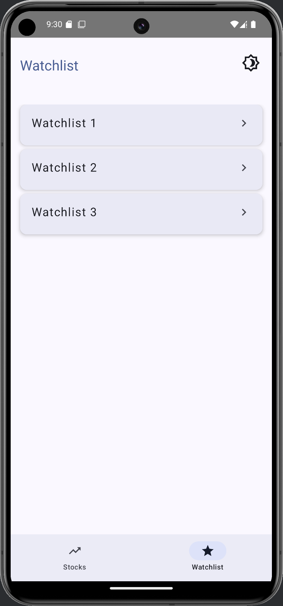

# 📈 Finure - Stocks & ETFs Android App

> **Note**: This application was developed as part of a technical assignment for **Groww**.

**Finure** is a modern, feature-rich Android application for tracking stocks and ETFs using real-time market data. Built entirely with **Kotlin** and powered by **Alpha Vantage API**, Finure enables users to explore top gainers/losers, manage watchlists, and view detailed stock insights — all with a clean UI and support for light/dark themes.

---

## ✨ Features

- 🔍 **Explore Screen**  
  View **Top Gainers** and **Top Losers** with real-time stock data in a responsive grid layout.

- ⭐ **Watchlist Management**  
  Create, delete, and view watchlists. Supports multiple watchlists with custom names.

- 📊 **Product (Stock Detail) Screen**  
  View in-depth stock details like market cap, P/E ratio, profit margins, and more. Includes a **line graph** for visualizing stock trends. Add/remove stocks from watchlists directly.

- ➕ **Add to Watchlist Dialog**  
  Add stocks to existing watchlists or create new ones using a user-friendly popup dialog.

- 📄 **View All Screen**  
  Paginated view for browsing all stocks under a specific category (like all gainers or losers).

- 💡 **Dynamic Light/Dark Theme**  
  Toggle between light and dark mode using a single button.

- 🔃 **Caching with Expiry**  
  Cached responses from the API (with 10-minute expiration) to reduce bandwidth usage.

---

## 📸 Screenshots

<table>
  <tr>
    <td></td>
    <td></td>
  </tr>
  <tr>
    <td align="center">Explore Screen</td>
    <td align="center">View All Screen</td>
  </tr>
  <tr>
    <td></td>
    <td></td>
  </tr>
  <tr>
    <td align="center">Watchlist Screen (All Lists)</td>
    <td align="center">Watchlists Screen (Stocks in a List)</td>
  </tr>
  <tr>
    <td></td>
    <td></td>
  </tr>
  <tr>
    <td align="center">Product Screen</td>
    <td align="center">Add to Watchlist Popup</td>
  </tr>
</table>

---

## 🏗️ Tech Stack

- **Language:** Kotlin
- **UI Toolkit:** Jetpack Compose
- **Architecture:** MVVM
- **Dependency Injection:** Hilt (Dagger)
- **Networking:** Retrofit + Gson
- **State Handling:** Kotlin Coroutines + StateFlow
- **Charting:** MPAndroidChart (for Line Graph)
- **Caching:** In-memory cache with expiration logic

---

## 🔗 API Usage

This app uses the [Alpha Vantage API](https://www.alphavantage.co/documentation/) for the following:

- `TOP_GAINERS_LOSERS`: To fetch top gainers and losers.
- `OVERVIEW`: To fetch company/stock fundamentals.
- `SYMBOL_SEARCH`: For ticker search functionality.

> Make sure to generate your own API key at [Alpha Vantage](https://www.alphavantage.co/support/#api-key).  
> The free tier has a **limit of 25 requests/day**.

---

## 📦 APK & Release

- ✅ [Download latest APK (Google Drive)](https://drive.google.com/file/d/1sImhdyLjPuGNm-YgqSbeFHF7VxpFOMIY/view?usp=sharing)
- 📺 [View demo video (Screen Recording)](https://drive.google.com/file/d/1_3ONs7Ll7oAk4RuBPyyfUbbvI5gozGcQ/view?usp=sharing)

---

## 🧠 Future Improvements (Optional Enhancements)

- ✅ Implement persistent storage for watchlists (e.g., Room or DataStore)
- 🔍 Enable ticker search functionality
- 📈 Integrate additional endpoints (e.g., historical price, news, earnings)
- 🔄 Improve pagination and pull-to-refresh support

---

## 🙌 Acknowledgments

- [Alpha Vantage](https://www.alphavantage.co) for their awesome API
- [MPAndroidChart](https://github.com/PhilJay/MPAndroidChart) for beautiful charting
- Jetpack libraries from AndroidX and Google

---

## 👤 Author

**Archit Jain**
💼 [LinkedIn](https://www.linkedin.com/in/archit-jain-3929a024a/)  
💻 [GitHub](https://github.com/architj71)
